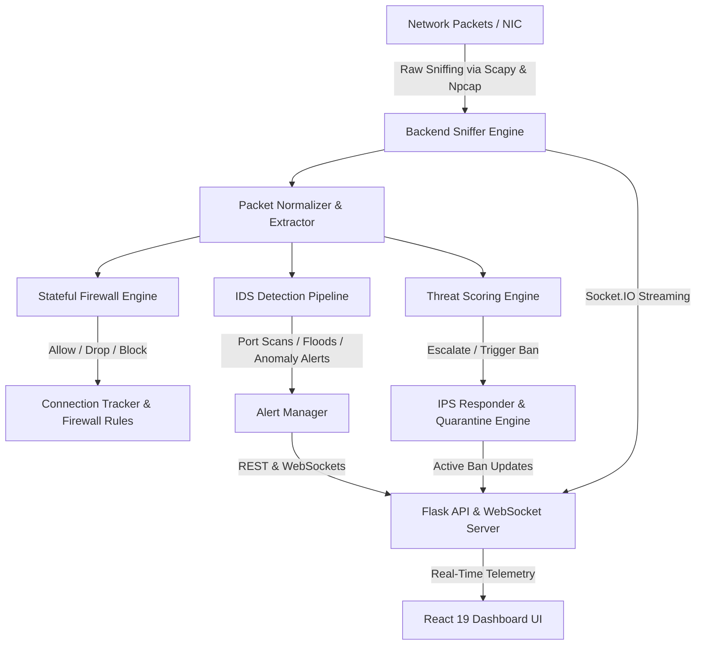

# PROJECT MEMORY - Network Firewall, IDS & IPS Suite

> **Project Name:** Modular Network Firewall, Intrusion Detection (IDS) & Intrusion Prevention System (IPS)  
> **Last Updated:** August 15, 2026  
> **Primary Technology Stack:** Python (Scapy, Flask, Socket.IO) + React 19 (Vite, Redux Toolkit, Tailwind CSS, Recharts)

---

## 1. Project Vision & Architecture Overview

The **Network Firewall, IDS & IPS Suite** is a full-stack, enterprise-grade network security monitoring and defense platform. It combines real-time deep packet inspection (DPI), stateful firewall packet filtering, anomaly-based and signature-based Intrusion Detection (IDS), and dynamic auto-mitigation Intrusion Prevention (IPS) capabilities with an interactive real-time web control dashboard.



---

## 2. Core Subsystems & Components

### 2.1 Backend Core (`backend/`)

#### A. Packet Sniffer (`backend/sniffer/` & `backend/main.py`)
- **Engine:** Leverages `scapy` and `Npcap` driver (on Windows) to intercept Layer 3 and Layer 4 raw network traffic (IP, TCP, UDP, ICMP).
- **Normalizer (`backend/engine/packet/`):** Extracts metadata (src/dst IP, src/dst port, protocol, payload size, TCP flags, sequence numbers).

#### B. Stateful Firewall Engine (`backend/engine/firewall/`)
- **Rule Evaluator (`engine.py`, `evaluator.py`):** Compares network packet attributes against inbound/outbound security rules.
- **State Tracker (`stateful_evaluvator.py`, `session_tracker.py`, `connection_table.py`):** Tracks TCP handshakes and connection states (`NEW_SESSION`, `ESTABLISHED`, `FIN_WAIT`, `CLOSED`).
- **Active Blocker (`blocker.py`):** Enforces immediate IP/port packet dropping.

#### C. Intrusion Detection System - IDS (`backend/engine/IDS/`)
- **Detection Pipeline (`detection_pipeline.py`):** Sequentially runs packet evaluations against heuristic & signature detectors.
- **Port Scan Detector (`detector.py`, `recon_detector.py`):** Detects rapid multi-port probes from single IP sources within sliding time windows.
- **Flood / DDoS Detector (`flood_detector.py`):** Identifies SYN flood, UDP flood, and volumetric traffic spikes.
- **Alert Manager (`alert_manager.py`, `tracker.py`):** Aggregates security events, assigns unique alert IDs, and dispatches alerts.

#### D. Intrusion Prevention System - IPS (`backend/engine/IPS/`)
- **IPS Pipeline (`ips_pipeline.py`, `response_policy.py`):** Triggers automated mitigation rules based on alert severity.
- **Block & Quarantine Manager (`block_manager.py`, `ban_tracker.py`, `quarantine_engine.py`):** Dynamically adds offending IPs to temporary or permanent ban lists.
- **Unblock & Whitelist Manager (`unblock_manager.py`, `whitelist_engine.py`):** Manages IP expiration timers and protected IP whitelists.
- **Escalation Engine (`esclate_engine.py`):** Automatically upgrades repeated low-severity IDS alerts to high-severity IPS block actions.

#### E. Threat Scoring System (`backend/engine/scoring/`)
- Dynamically calculates numerical threat scores (0 - 100) per source IP using threat weights, event frequency, and signature severity.

#### F. REST API & WebSocket Server (`backend/api/`)
- **Framework:** Flask + Flask-CORS + Flask-SocketIO + Eventlet.
- **Blueprints / Routes (`backend/api/routes/`):**
  - `/api/traffic` (`traffic.py`): Real-time and historical packet capture statistics.
  - `/api/alerts` (`alert.py`): Active and historical IDS alert query endpoints.
  - `/api/firewall` (`firewall.py`): Stateful table inspect and active block rules.
  - `/api/ips` (`ips.py`): Active IP bans, quarantine lists, whitelist management.
  - `/api/rules` (`rules.py`): CRUD operations for firewall policies & IDS signatures.
  - `/api/logs` (`logs.py`): System and engine audit log access.
- **WebSocket Broadcast (`services/websocket_service.py`):** Streams live packet telemetry, bandwidth rates, and real-time security alerts directly to connected frontend clients.

---

### 2.2 Frontend Application (`frontend/`)

#### Architecture & Tech Stack
- **Framework:** React 19 + Vite 8
- **State Management:** Redux Toolkit (`@reduxjs/toolkit`, `react-redux`)
- **Styling:** Tailwind CSS v4 + Vanilla CSS + Framer Motion animations
- **Icons:** Lucide React (`lucide-react`)
- **Data Visualization:** Recharts (`recharts`)
- **Networking:** Axios + Socket.IO Client (`socket.io-client`)

#### Pages & Views (`frontend/src/pages/`)
1. **`Dashboard.jsx`:** Executive security dashboard featuring key metrics (total packets, active threats, bandwidth throughput, active bans), real-time traffic charts, threat severity feeds, and active alerts.
2. **`NetworkTraffic.jsx`:** Real-time stream of intercepted packets with protocol filters (TCP/UDP/ICMP), search by IP, and packet detail modals.
3. **`Firewall.jsx`:** Stateful connection table viewer, active firewall policy list, and quick IP/port blocking interface.
4. **`IDSAlerts.jsx`:** Interactive security event log displaying detection signatures, target IPs, threat scores, and severity classifications (Low/Medium/High/Critical).
5. **`IPSActions.jsx`:** Active IP quarantine control panel, automatic mitigation status, ban expiration counters, and whitelist manager.
6. **`RulesManager.jsx`:** Visual editor to add, update, enable/disable, or delete firewall rules, port scan sensitivity limits, and signature patterns.
7. **`LogsViewer.jsx`:** Searchable log reader with severity filtering and export functionality for system, firewall, and IDS audit logs.
8. **`PacketInspector.jsx`:** Low-level Deep Packet Inspection (DPI) viewer with raw byte/hex inspection and TCP flag breakdowns.
9. **`Settings.jsx`:** Configuration panel for network interface selection, sniffer parameters, socket connection status, and alert thresholds.

---

## 3. Directory & File Structure

```
Firewall/
├── backend/
│   ├── api/
│   │   ├── routes/
│   │   │   ├── alert.py
│   │   │   ├── firewall.py
│   │   │   ├── ips.py
│   │   │   ├── logs.py
│   │   │   ├── rules.py
│   │   │   └── traffic.py
│   │   ├── services/
│   │   │   └── websocket_service.py
│   │   └── api.py                   # Main Flask API & WebSocket Entry Point
│   ├── engine/
│   │   ├── firewall/
│   │   │   ├── engine.py
│   │   │   ├── blocker.py
│   │   │   ├── session_tracker.py
│   │   │   └── stateful_evaluvator.py
│   │   ├── IDS/
│   │   │   ├── alert_manager.py
│   │   │   ├── detection_pipeline.py
│   │   │   ├── detector.py
│   │   │   ├── flood_detector.py
│   │   │   └── recon_detector.py
│   │   ├── IPS/
│   │   │   ├── ban_tracker.py
│   │   │   ├── block_manager.py
│   │   │   ├── ips_pipeline.py
│   │   │   ├── response_policy.py
│   │   │   └── whitelist_engine.py
│   │   ├── packet/
│   │   │   └── packet_normalizer.py
│   │   ├── scoring/
│   │   └── rules/
│   ├── sniffer/
│   │   └── sniffer.py
│   ├── logs/                        # Generated runtime log storage
│   ├── venv/                        # Python virtual environment
│   ├── main.py                      # CLI Sniffer & Detection Pipeline tester
│   └── requirements.txt             # Python backend dependencies
├── frontend/
│   ├── public/
│   ├── src/
│   │   ├── components/              # Navigation, layout, cards, and modal components
│   │   ├── pages/                   # Main application route components
│   │   ├── services/                # Axios API client & Socket.IO initialization
│   │   ├── store/                   # Redux Toolkit slices
│   │   ├── App.jsx
│   │   ├── main.jsx
│   │   └── index.css
│   ├── package.json                 # React + Vite dependencies and scripts
│   ├── vite.config.js               # Vite bundler configuration
│   └── tailwind.config.js
├── build_frontend.py                # Build automation helper script
├── generate_pages.py                # Page template generation script
├── file_structure.md                # Detailed component blueprint
├── deep-research-report.md          # Technical research & specifications
├── npcap-1.88.exe                   # Windows Npcap packet capture driver installer
└── PROJECT_MEMORY.md                # Project architecture & memory reference (This file)
```

---

## 4. Key Configurations & Environment Setup

### 4.1 Prerequisites
- **Operating System:** Windows 10/11 (or Linux/macOS with elevated privileges)
- **Python Version:** 3.10+
- **Node.js Version:** 18+ (npm 9+)
- **Packet Driver (Windows):** Npcap (`npcap-1.88.exe` included in root). Must be installed with *WinPcap API compatibility mode* enabled.

---

## 5. How to Run the Application

### 5.1 Backend Setup & Execution
> ⚠️ **Note:** Packet sniffing requires Administrator privileges on Windows. Run your terminal/shell as Administrator.

```powershell
# 1. Navigate to the backend directory
cd p:\Firewall\backend

# 2. Activate virtual environment (if present)
.\venv\Scripts\Activate.ps1

# 3. Install Python dependencies (if needed)
pip install -r requirements.txt

# 4. Option A: Run Full API + WebSocket Server + Sniffer Background Thread
python api/api.py

# 5. Option B: Run Standalone CLI Engine & Sniffer Demo
python main.py
```

### 5.2 Frontend Setup & Execution

```powershell
# 1. Navigate to the frontend directory
cd p:\Firewall\frontend

# 2. Install Node dependencies
npm install

# 3. Start Development Server
npm run dev

# 4. Build for Production
npm run build
```

---

## 6. Development Conventions & System Guidelines

1. **Stateful Connection Tracking:** All incoming packets pass through `stateful_evaluvator.py` before IDS analysis to verify TCP handshake validity and filter out invalid/spoofed out-of-order packets.
2. **Real-time WebSockets:** Live packet events are broadcast using Socket.IO from `websocket_service.py` to ensure low latency updates (<50ms) on the dashboard.
3. **Responsive Dark UI Design:** The UI utilizes a dark glassmorphic design palette (deep slates, vibrant cyan accents, glowing red threat badges, emerald green status indicators) for optimal SOC/NOC monitoring experience.
4. **Privilege Requirements:** Any features interacting with socket-level packet injection or Npcap sniffing must execute under administrative rights.

---

*This document serves as the persistent memory state for the Firewall, IDS & IPS Suite project.*
