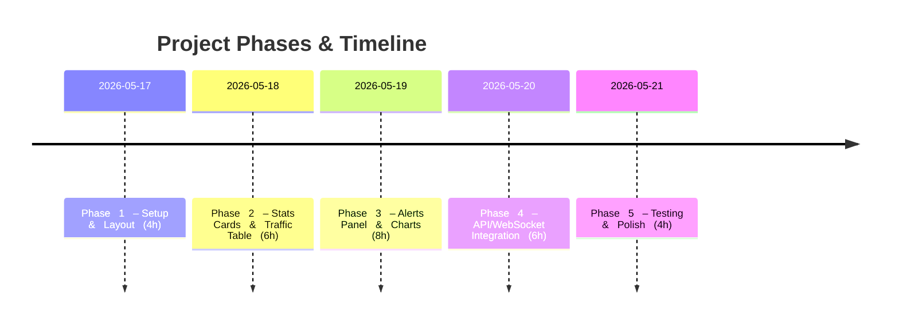

# Executive Summary

Building a professional Cybersecurity SOC dashboard involves setting up a modern React + Tailwind CSS project, then incrementally adding UI components (sidebar, navbar, cards, tables, alerts, charts, etc.) and wiring them to mock data before connecting to real APIs. We will follow a **phased plan** (see *Timeline*) and provide exact setup commands, file structures, and reusable code snippets for each component. We assume you have Node.js and npm installed. The stack includes **Vite** (for fast React dev) and **Tailwind CSS** (for utility-first styling)【1†L290-L298】. We’ll use **Lucide** icons【8†L125-L133】, **Framer Motion** for animations【11†L55-L61】, and **Recharts** or **react-chartjs-2** for charts. Each phase has clear goals, tasks, deliverables and estimated effort. We’ll start with an MVP (layout, sidebar, navbar, stats cards, traffic table with mock JSON) and then add more features (alerts, charts, API integration, live updates). The result will be a dark-mode, responsive SOC dashboard suitable for a resume portfolio.

## Project Timeline (Phases & Hours)



| Phase   | Goals                                        | Est. Time |
|--------|----------------------------------------------|----------|
| **1**   | Setup Vite+Tailwind, create project, layout  | 4h       |
| **2**   | Implement responsive Sidebar, Navbar, Stats Cards, Traffic Table (mock data) | 6h |
| **3**   | Build Alerts Panel, Blocked IPs table, Charts with mock data | 8h |
| **4**   | Connect to (mock) Flask APIs or WebSocket, replace mock data | 6h |
| **5**   | Testing, responsive tweaks, documentation    | 4h       |

**Dependencies:** Node.js (>=16) and npm must be installed to use Vite【1†L290-L298】. We’ll install React, Tailwind, Lucide, Framer Motion, Axios, Recharts, etc. The **component responsibilities** are:

| Component         | Responsibility                                |
|-------------------|-----------------------------------------------|
| **Sidebar.jsx**   | Navigation menu (Dashboard, Traffic, IDS, IPS, Analytics, etc.) |
| **Navbar.jsx**    | Top bar with title, search, notifications, profile |
| **StatsCard.jsx** | Display key metrics (packets, threats, blocks, connections) |
| **TrafficTable.jsx** | Live traffic logs table with IPs, ports, actions |
| **AlertsPanel.jsx** | Show recent IDS/IPS alerts (type, IP, time) |
| **BlockedIPs.jsx** | Table of blocked IPs and reasons |
| **TrafficChart.jsx** | Traffic-over-time (Line Chart) |
| **ProtocolChart.jsx** | Protocol distribution (Pie/Bar Chart) |

The **folder structure** will look like:

```
frontend/
├── src/
│   ├── assets/          
│   ├── components/
│   │   ├── layout/
│   │   │   ├── Sidebar.jsx
│   │   │   └── Navbar.jsx
│   │   ├── dashboard/
│   │   │   ├── StatsCard.jsx
│   │   │   ├── TrafficTable.jsx
│   │   │   ├── AlertsPanel.jsx
│   │   │   ├── BlockedIPs.jsx
│   │   ├── charts/
│   │   │   ├── TrafficChart.jsx
│   │   │   └── ProtocolChart.jsx
│   ├── pages/
│   │   └── Dashboard.jsx
│   ├── services/
│   │   └── api.js
│   ├── data/
│   │   └── mockData.js
│   ├── App.jsx
│   └── main.jsx
├── tailwind.config.js
├── postcss.config.js
└── package.json
```

This structure keeps components modular and organized for growth.

【35†embed_image】 *Example visualization of a modern SOC dashboard (dark theme with charts and alerts).*

## Phase 1 — Setup & Layout

**Goals:** Initialize the React/Vite project, configure Tailwind CSS, and build the basic app layout (Sidebar + Navbar) with placeholder content. This establishes the app scaffold【1†L290-L298】.

- **Deliverables:** A Vite-React project with Tailwind, a responsive sidebar and top navbar, and a placeholder Dashboard page.
- **Steps:**

  1. **Create Vite React Project:**  
     ```bash
     npm create vite@latest frontend -- --template react
     cd frontend
     npm install
     ```  
     This scaffolds a React app using Vite【1†L290-L298】.

  2. **Install Tailwind CSS:**  
     ```bash
     npm install -D tailwindcss@4 postcss autoprefixer
     npx tailwindcss init -p
     ```  
     (Use `@3` if v4 not released; adjust commands accordingly.) This also creates **`tailwind.config.js`** and **`postcss.config.js`**【1†L293-L302】.

  3. **Configure Tailwind:**  
     In **`tailwind.config.js`**, enable Tailwind on our JSX files and set dark mode:
     ```js
     // tailwind.config.js
     export default {
       content: [
         "./index.html",
         "./src/**/*.{js,jsx,ts,tsx}",
       ],
       darkMode: 'class', // enable manual 'dark' class
       theme: {
         extend: {},
       },
       plugins: [],
     };
     ```  
     This follows the official Tailwind guide【1†L307-L314】.  

  4. **Add Tailwind Directives:**  
     Create **`src/index.css`** and add Tailwind’s layers:
     ```css
     @tailwind base;
     @tailwind components;
     @tailwind utilities;
     ```
     Import **`index.css`** in **`main.jsx`** (generated by Vite) or **`App.jsx`** to apply styles.

  5. **Set Up Layout Components:** Create **`Sidebar.jsx`** and **`Navbar.jsx`** under **`src/components/layout/`**. Example code for **`App.jsx`**:
     ```jsx
     // src/App.jsx
     import Sidebar from './components/layout/Sidebar';
     import Navbar from './components/layout/Navbar';

     function App() {
       return (
         <div className="min-h-screen bg-gray-900 text-gray-100">
           <Sidebar />
           <main className="flex-1 flex flex-col">
             <Navbar />
             <div className="p-4">
               {/* Dashboard page content will go here */}
               <h1 className="text-3xl font-bold">Dashboard</h1>
               <p className="mt-4">Welcome to your SOC dashboard.</p>
             </div>
           </main>
         </div>
       );
     }
     export default App;
     ```
     - **`Sidebar.jsx`**: Use Tailwind classes (`bg-gray-800`, `hover:bg-gray-700`, etc.) to style a vertical menu (links for Dashboard, Traffic, IDS Alerts, etc.).  
     - **`Navbar.jsx`**: Create a top bar with the title (e.g. “SentinelX Firewall”), a search box, and placeholders for notifications/profile. Use `flex` utilities for layout.  

     This establishes a responsive two-column layout with sidebar (fixed width) and main content【26†L298-L304】.

- **Check:** Run `npm run dev`. You should see a blank dashboard page with your layout. No errors should appear. If you see unstyled content, verify **`index.css`** import and Tailwind setup.
- **Estimated Time:** 4h

【41†embed_image】 *Sample dark sidebar design. Use similar classes (e.g. `bg-gray-800`, `hover:bg-gray-700`) for your Sidebar component.*

## Phase 2 — Stats Cards & Traffic Table (MVP Data)

**Goals:** Add **Stats Cards** at top of dashboard and a **Live Traffic Table** below, using mock JSON data. This makes the UI feel dynamic even before connecting APIs. Focus on responsive grid layouts and Tailwind styling.

- **Deliverables:** Four stats cards (Packets, Threats, Blocked, Connections) with icons, and a traffic logs table with colored status badges.
- **Steps:**

  1. **Mock Data:** Create **`src/data/mockData.js`** exporting sample data. For example:
     ```js
     // src/data/mockData.js
     export const stats = [
       { id: 1, title: "Total Packets", value: 10234, icon: "Layers", trend: "+12%" },
       { id: 2, title: "Threats Detected", value: 23, icon: "AlertOctagon", trend: "+5%" },
       { id: 3, title: "Blocked IPs", value: 17, icon: "Lock", trend: "-2%" },
       { id: 4, title: "Active Conns", value: 120, icon: "Network", trend: "+8%" },
     ];
     export const trafficLogs = [
       // sample rows
       { time: "10:05:21", src: "192.168.1.5", dest: "10.0.0.7", protocol: "TCP", port: 443, action: "ALLOW" },
       { time: "10:06:05", src: "10.0.0.7", dest: "10.0.0.10", protocol: "UDP", port: 53, action: "BLOCK" },
       // ... more entries
     ];
     ```
     This data drives the UI components. We will later replace these with API calls.

  2. **StatsCard Component:** In **`src/components/dashboard/StatsCard.jsx`**, use props for title, value, icon, etc. Use **Lucide** icons (install with `npm install lucide-react`)【8†L125-L133】. Example:
     ```jsx
     // src/components/dashboard/StatsCard.jsx
     import { ArrowUp, ArrowDown } from 'lucide-react';

     export default function StatsCard({ title, value, icon: Icon, trend }) {
       return (
         <div className="bg-gray-800 p-4 rounded-lg flex items-center hover:shadow-lg transition">
           <div className="p-3 bg-gray-700 rounded-full">
             <Icon className="h-6 w-6 text-cyan-400" />
           </div>
           <div className="ml-4">
             <p className="text-sm text-gray-400">{title}</p>
             <p className="text-2xl font-semibold">{value}</p>
             <div className="flex items-center mt-1">
               {trend.startsWith('+') ? (
                 <ArrowUp className="h-4 w-4 text-green-400" />
               ) : (
                 <ArrowDown className="h-4 w-4 text-red-400" />
               )}
               <span className="text-xs ml-1 text-gray-400">{trend}</span>
             </div>
           </div>
         </div>
       );
     }
     ```
     In **`Dashboard.jsx`**, import `stats` from mockData and render:
     ```jsx
     import { stats } from '../data/mockData';
     import StatsCard from '../components/dashboard/StatsCard';

     <div className="grid grid-cols-1 sm:grid-cols-2 lg:grid-cols-4 gap-4 mb-4">
       {stats.map(card => (
         <StatsCard 
           key={card.id}
           title={card.title}
           value={card.value}
           icon={require(`lucide-react`).unpkg.defaultIcons[card.icon]} // or direct import
           trend={card.trend}
         />
       ))}
     </div>
     ```
     This creates a responsive grid of cards. On hover, we use a glow or shadow for effect (see **`hover:shadow-lg`** above).

  3. **TrafficTable Component:** Create **`src/components/dashboard/TrafficTable.jsx`**. Use a `<table>` with Tailwind classes (`table-auto`, `min-w-full`, `text-sm`, etc.). Example snippet:
     ```jsx
     // src/components/dashboard/TrafficTable.jsx
     export default function TrafficTable({ data }) {
       return (
         <table className="min-w-full divide-y divide-gray-700">
           <thead>
             <tr className="bg-gray-800">
               {["Time", "Source IP", "Dest IP", "Protocol", "Port", "Action"].map(col => (
                 <th key={col} className="px-3 py-2 text-left text-xs font-medium text-gray-400 uppercase">{col}</th>
               ))}
             </tr>
           </thead>
           <tbody className="divide-y divide-gray-700">
             {data.map((row, i) => (
               <tr key={i} className="hover:bg-gray-700">
                 <td className="px-3 py-2 font-mono text-xs">{row.time}</td>
                 <td className="px-3 py-2 font-mono">{row.src}</td>
                 <td className="px-3 py-2 font-mono">{row.dest}</td>
                 <td className="px-3 py-2">{row.protocol}</td>
                 <td className="px-3 py-2">{row.port}</td>
                 <td className={`px-3 py-2 font-semibold ${
                   row.action === 'ALLOW' ? 'text-green-400' :
                   row.action === 'BLOCK' ? 'text-red-500' : 'text-yellow-500'
                 }`}>{row.action}</td>
               </tr>
             ))}
           </tbody>
         </table>
       );
     }
     ```
     Then render in **`Dashboard.jsx`**:
     ```jsx
     import { trafficLogs } from '../data/mockData';
     import TrafficTable from '../components/dashboard/TrafficTable';

     <div className="bg-gray-800 p-4 rounded-lg">
       <h2 className="text-lg font-semibold mb-2">Live Traffic</h2>
       <TrafficTable data={trafficLogs} />
     </div>
     ```
     Color-code the “Action” cell: green for ALLOW, red for BLOCK, yellow for ALERT (using Tailwind text colors as above).

- **Check:** The dashboard should now show four stats cards and a scrollable traffic table. Verify layout on various screen sizes (use devtools to simulate phone). Ensure Tailwind dark-mode classes work if you add a `dark` class (e.g. on `<html class="dark">`).

- **Estimated Time:** 6h

【52†embed_image】 *An example dark analytics dashboard layout. Notice the KPI cards at top and charts below. (Use Chart.js/Recharts for similar charts later.)*  

## Phase 3 — Alerts Panel & Charts

**Goals:** Enhance the UI with an **Alerts Panel**, **Blocked IPs Table**, and basic **Charts**. Use the mock data or simple arrays. This demonstrates data visualization and makes the dashboard interactive.

- **Deliverables:**  
  - **AlertsPanel:** A list of recent IDS alerts (port scan, SYN flood, etc.).  
  - **BlockedIPs:** A table of blocked IPs with reasons and timestamps.  
  - **Charts:** Three charts – Traffic Over Time (line), Protocol Distribution (pie), Threat Types (bar).  

- **Steps:**

  1. **Mock Alerts & Blocked Data:** Extend **`mockData.js`**:
     ```js
     export const alerts = [
       { id: 1, type: "Port Scan", src: "10.0.0.5", severity: "Medium", time: "10:15:30" },
       { id: 2, type: "SYN Flood", src: "10.0.0.12", severity: "High", time: "10:17:45" },
       // ...
     ];
     export const blockedIPs = [
       { ip: "10.0.0.5", reason: "Port Scan", time: "10:15:35" },
       { ip: "10.0.0.8", reason: "Malware", time: "10:18:10" },
       // ...
     ];
     ```
  
  2. **AlertsPanel Component:** In **`src/components/dashboard/AlertsPanel.jsx`**, iterate over alerts and style each with a colored badge. Example:
     ```jsx
     // src/components/dashboard/AlertsPanel.jsx
     export default function AlertsPanel({ alerts }) {
       return (
         <div className="bg-gray-800 p-4 rounded-lg">
           <h2 className="text-lg font-semibold mb-2">Threat Alerts</h2>
           <ul>
             {alerts.map(alert => (
               <li key={alert.id} className="flex items-center mb-3">
                 <div className="flex-1">
                   <p>
                     <span className="font-semibold text-red-500">{alert.type}</span> 
                     from <span className="font-mono">{alert.src}</span>
                   </p>
                   <p className="text-xs text-gray-400">{alert.time}</p>
                 </div>
                 <span className={`ml-4 px-2 text-xs rounded ${
                   alert.severity === 'High' ? 'bg-red-600' :
                   alert.severity === 'Medium' ? 'bg-yellow-600' : 'bg-green-600'
                 }`}>
                   {alert.severity}
                 </span>
               </li>
             ))}
           </ul>
         </div>
       );
     }
     ```
     Render it in **`Dashboard.jsx`**:
     ```jsx
     import { alerts } from '../data/mockData';
     import AlertsPanel from '../components/dashboard/AlertsPanel';
     import BlockedIPs from '../components/dashboard/BlockedIPs';

     <div className="grid grid-cols-1 lg:grid-cols-2 gap-4 mb-4">
       <AlertsPanel alerts={alerts} />
       <BlockedIPs data={blockedIPs} />
     </div>
     ```
  
  3. **BlockedIPs Component:** In **`src/components/dashboard/BlockedIPs.jsx`**, display a table similar to TrafficTable:
     ```jsx
     // src/components/dashboard/BlockedIPs.jsx
     export default function BlockedIPs({ data }) {
       return (
         <div className="bg-gray-800 p-4 rounded-lg">
           <h2 className="text-lg font-semibold mb-2">Blocked IPs</h2>
           <table className="min-w-full divide-y divide-gray-700">
             <thead>
               <tr className="bg-gray-800">
                 {["IP Address", "Reason", "Blocked At"].map(col => (
                   <th key={col} className="px-3 py-2 text-left text-xs font-medium text-gray-400">{col}</th>
                 ))}
               </tr>
             </thead>
             <tbody className="divide-y divide-gray-700">
               {data.map((row, i) => (
                 <tr key={i}>
                   <td className="px-3 py-2 font-mono text-sm">{row.ip}</td>
                   <td className="px-3 py-2 text-sm">{row.reason}</td>
                   <td className="px-3 py-2 text-xs text-gray-400">{row.time}</td>
                 </tr>
               ))}
             </tbody>
           </table>
         </div>
       );
     }
     ```

  4. **Charts Setup:** Install **Recharts** (or **react-chartjs-2**). For example: `npm install recharts`【51†L49-L52】. Create components:
     - **TrafficChart.jsx:** Use `<LineChart>` from Recharts. Example skeleton:
       ```jsx
       // src/components/charts/TrafficChart.jsx
       import { LineChart, Line, XAxis, YAxis, Tooltip, ResponsiveContainer } from 'recharts';
       import { trafficChartData } from '../data/mockData'; // define in mockData

       export default function TrafficChart() {
         return (
           <div className="bg-gray-800 p-4 rounded-lg">
             <h2 className="text-lg font-semibold mb-2">Traffic Over Time</h2>
             <ResponsiveContainer width="100%" height={200}>
               <LineChart data={trafficChartData}>
                 <XAxis dataKey="time" stroke="#ccc" />
                 <YAxis stroke="#ccc" />
                 <Tooltip wrapperStyle={{ color: '#000' }} />
                 <Line type="monotone" dataKey="value" stroke="#00e5ff" strokeWidth={2}/>
               </LineChart>
             </ResponsiveContainer>
           </div>
         );
       }
       ```
     - **ProtocolChart.jsx:** Use `<PieChart>` to show distribution of TCP/UDP/ICMP. Example skeleton:
       ```jsx
       // src/components/charts/ProtocolChart.jsx
       import { PieChart, Pie, Cell, Tooltip, ResponsiveContainer } from 'recharts';
       import { protocolData } from '../data/mockData';

       export default function ProtocolChart() {
         const COLORS = ['#00e5ff', '#ffb703', '#ff3b3b'];
         return (
           <div className="bg-gray-800 p-4 rounded-lg">
             <h2 className="text-lg font-semibold mb-2">Protocol Distribution</h2>
             <ResponsiveContainer width="100%" height={200}>
               <PieChart>
                 <Pie data={protocolData} dataKey="value" nameKey="protocol" outerRadius={80} fill="#82ca9d" label>
                   {protocolData.map((entry, index) => (
                     <Cell key={`cell-${index}`} fill={COLORS[index % COLORS.length]} />
                   ))}
                 </Pie>
                 <Tooltip wrapperStyle={{ backgroundColor: '#333', borderColor: '#444' }}/>
               </PieChart>
             </ResponsiveContainer>
           </div>
         );
       }
       ```
     - (You may similarly create a **ThreatChart.jsx** with `<BarChart>` for threat types.)
     - Provide mock arrays (`trafficChartData`, `protocolData`, etc.) in `mockData.js`.

     Finally, render charts in **`Dashboard.jsx`** inside a responsive grid:
     ```jsx
     <div className="grid grid-cols-1 md:grid-cols-2 gap-4 mb-4">
       <TrafficChart />
       <ProtocolChart />
       {/* Add ThreatChart if created */}
     </div>
     ```

- **Check:** The dashboard now has alert cards (with severity badges), a blocked IP table, and two charts. Verify the charts render (they should match Recharts examples). If charts are empty, double-check the data arrays and Recharts imports.

- **Estimated Time:** 8h

【52†embed_image】 *Charts and stats cards integration. We used Tailwind classes for layout and Recharts for visualization.*  

## Phase 4 — API & WebSocket Integration

**Goals:** Replace mock data with actual API calls and (optionally) WebSocket updates. We’ll create an **API service stub** and simulate fetching logs/alerts from a backend (Flask). This connects frontend with backend logic.

- **Deliverables:** Axios service for fetching alerts/traffic, WebSocket (or polling) integration for live updates, real data wiring.
- **Steps:**

  1. **API Service:** In **`src/services/api.js`**, use Axios:
     ```js
     // src/services/api.js
     import axios from 'axios';
     const API_BASE = "http://localhost:5000"; // Flask server URL

     export const fetchAlerts = async () => {
       const res = await axios.get(`${API_BASE}/alerts`);
       return res.data; // assume JSON array
     };
     export const fetchBlocked = async () => {
       const res = await axios.get(`${API_BASE}/blocked`);
       return res.data;
     };
     export const fetchTraffic = async () => {
       const res = await axios.get(`${API_BASE}/traffic`);
       return res.data;
     };
     ```
     (Your Flask API can serve `/alerts`, `/blocked`, `/traffic` by reading logs or database.)

  2. **Connecting in Components:** In components like **`Dashboard.jsx`**, use `useEffect` hooks to call these services on load:
     ```jsx
     import { fetchAlerts, fetchBlocked, fetchTraffic } from '../services/api';
     // ...
     useEffect(() => {
       fetchAlerts().then(setAlerts);
       fetchBlocked().then(setBlockedIPs);
       fetchTraffic().then(setTrafficLogs);
     }, []);
     ```
     Ensure CORS is enabled on Flask (e.g. `flask_cors`) so the frontend (http://localhost:3000) can call the backend.

  3. **WebSocket (Optional):** For real-time updates, you can use **Flask-SocketIO** on backend and **socket.io-client** on React. Example pattern:
     ```jsx
     // src/services/socket.js
     import { io } from "socket.io-client";
     export const socket = io("http://localhost:5000");
     ```
     Then in **`Dashboard.jsx`**:
     ```jsx
     useEffect(() => {
       socket.on('new-traffic', data => {
         setTrafficLogs(prev => [...data, ...prev]); // prepend new packets
       });
       socket.on('new-alert', alert => {
         setAlerts(prev => [alert, ...prev]);
       });
       // Cleanup on unmount:
       return () => { socket.off('new-traffic'); socket.off('new-alert'); };
     }, []);
     ```
     The backend would emit these events when new logs appear. This provides live updates without manual refresh.

  4. **Replace Mock Data:** Remove references to `mockData.js` and feed components with state variables updated by API calls. Ensure components re-render when data arrives.

- **Check:** After connecting to your Flask app (run `python api.py`), verify the data flows into the UI. If using polling instead, implement periodic `setInterval` for fetches. Handling CORS and networking is the key here.

- **Estimated Time:** 6h

## Phase 5 — Testing, Polish & Deployment

**Goals:** Finalize UI, fix responsive issues, write documentation, and prepare for deployment. Create screens for portfolio or demo video.

- **Deliverables:** Responsive layout on all devices, smooth animations (Framer Motion), comments/docs, and final deliverable state.
- **Steps:**

  1. **Responsive Check:** Test on mobile widths; adjust grid breakpoints (e.g. make traffic table horizontal scroll, collapse sidebar on small screens with a toggle).
  2. **Add Animations:** Wrap key components (cards, table rows, alerts) with `<motion.div>` or use `whileHover` effects from **Framer Motion**【11†L98-L106】. For example:
     ```jsx
     import { motion } from 'framer-motion';
     // ...
     <motion.div 
       whileHover={{ scale: 1.02 }} 
       transition={{ type: 'spring', stiffness: 300 }}
       className="bg-gray-800 p-4 rounded-lg"
     >
       {/* content */}
     </motion.div>
     ```
     This adds subtle hover zoom to cards【11†L98-L106】.
  3. **Dark Mode Toggle (Optional):** Add a button in Navbar to toggle `dark` class on `<html>` (persist in localStorage as in Tailwind docs【26†L325-L332】).
  4. **Testing:** Ensure data displays correctly, inspect console for errors. Possibly write simple unit tests or React Testing Library tests for components.
  5. **Deployment:** Build the React app (`npm run build`) and serve with an HTTP server. Update Flask CORS for production domain. Or deploy separately on Netlify/Heroku as needed. Document installation steps in a README.

- **Estimated Time:** 4h

## Summary of Built System

You will end up with:

- A **React + Tailwind** frontend (**Vite**-powered) serving a dark-themed SOC dashboard interface.  
- **Dynamic components**: Sidebar, Navbar, Stats Cards, Traffic Table, Alerts Panel, Blocked IPs table, and Charts.  
- **Mock and real data** flows via Axios/WebSocket from a Flask backend.  
- **Animations & design**: Framer Motion hover effects, Lucide icons, responsive layout and dark-mode theming.  

Each piece demonstrates relevant skills (React development, CSS utilities, data visualization, REST/WebSocket integration) that are attractive to recruiters. The charts and layout code are built with official libraries (TailwindCSS【1†L307-L314】, Recharts, etc.) ensuring best practices.

**Next Steps:** You can add features like geo-IP maps (show attack origin), threat scoring badges, or integration with threat intel feeds. But even this MVP is a strong, interview-ready project. Include screenshots, live demo, and the above architecture diagram (with diagrams like [35†embed_image]) in your portfolio/README.

