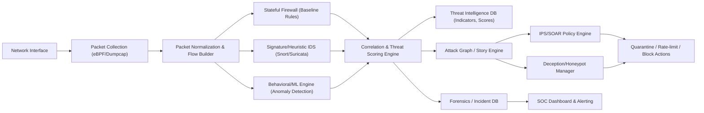
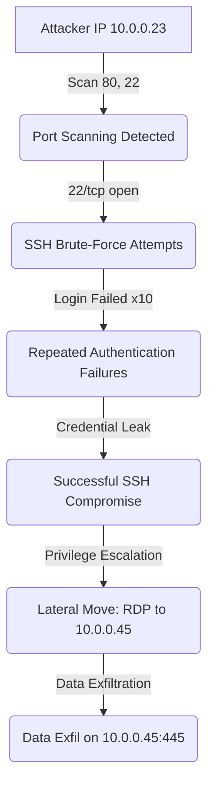

# Smart Self-Learning Firewall: Comprehensive Project Plan

**Executive Summary:** We propose building a next-generation **Adaptive Cyber Defense Platform** – an intelligent firewall/IDS/IPS/SOC system that *learns* from traffic, correlates events into attack stories, and autonomously responds.  Unlike static firewall or IDS projects, this system will integrate machine learning (supervised, unsupervised, reinforcement learning), rule/graph-based analysis, and deception to detect known and novel threats. Key innovations include an **Explainable Threat Score**, **Attack Story/Graph Engine**, **What-If Policy Simulator**, and a **Secure SOC UI**.  By continuously updating baselines of “normal” behavior and using predictive analytics, the platform can anticipate attacker next steps and take proactive measures.  We will benchmark against standard datasets (e.g. NSL-KDD, CIC-IDS) and open-source firewalls, demonstrating higher detection rates, lower false positives and faster response (e.g. recent research shows ML-adaptive firewalls can cut false positives by ~40%).  The phased roadmap covers foundational data pipelines, core detection/response engines, then autonomous defense and monitoring layers.  Success will be measured by metrics like detection accuracy, false-alarm rate, rule update latency, and incident resolution time.  We will differentiate by packaging these capabilities into a cohesive “digital twin” of the network – a unified view where analysts can simulate changes (“what-if block this IP”) and replay attacks against new rules – a feature not found in existing open-source projects.  

---

## Project Goals & Scope

- **Objective:** Build an **end-to-end adaptive firewall/IDS platform** that not only detects intrusions but *understands and predicts* multi-stage attacks and autonomously enforces policy. It should learn from real traffic, correlate events into coherent incidents, and suggest or enact countermeasures.
- **Scope:** Enterprise networks with mixed traffic (LAN/WAN, server, user hosts, IoT). No vendor lock-in: modular, containerized services. The system will handle packets/flows (L2–L7) and integrate with threat intel (blocklists, known signatures).
- **Key Deliverables:** 
  - An extendable **Packet Analysis Pipeline** (collection, normalization, feature extraction).  
  - **Detection engines:** signature-based IDS, anomaly/ML engine, behavior baselining.  
  - **Correlation engine:** attack-graph builder linking alerts into “attack stories”.  
  - **Autonomous response module:** policy engine driving firewall/IPS rules automatically (with safety controls).  
  - **Threat-scoring UI:** real-time dashboard showing incidents, attack graphs, risk scores.  
  - **Simulation tools:** policy simulator and attack replay for testing “what-if” scenarios.  
  - **Deception layer:** integrated honeypots and decoys to trap attackers and boost detection confidence.  
- **Unique Edge:** Unlike static firewalls (e.g. iptables, pfSense) or IDS like Suricata/Snort, our system will continuously *learn and adapt*. It will combine AI with graph analysis to provide an explainable, predictive security layer – a true **cyber defense digital twin** of the network.

## Threat Model & Success Metrics

- **Threat Model:**  
  - Adversaries range from external attackers (scanning, botnets, DDoS, malware) to insiders (privilege escalation). Attacks include reconnaissance, service enumeration, credential theft/brute-force, exploitation, lateral movement, data exfiltration.  
  - The network contains mixed OS (Linux/Windows servers, workstations, possibly IoT/SCADA). We assume adversaries can probe open ports, send malformed packets, and attempt known exploits. The system must focus on network-based detection (though it may consume host logs if integrated).  
  - We rely on strong baselines and multi-signal correlation to catch “zero-day” or novel tactics. Threat intelligence feeds (e.g. malicious IP lists) are used, but system must operate even without up-to-date signatures.
- **Success Metrics:**  
  - **Detection Rate:** True positive rate for known malicious traffic (target >95%).  
  - **False Positive Rate:** Keep false alarms low (target <5%) – as [29] showed, adaptive RL-based firewalls cut FPs by ~40%.  
  - **Mean Time to Detection/Response:** Time from attack start to alert/action (aim < seconds).  
  - **Rule Update Latency:** How quickly the system can generate and enforce new rules (target < 100ms after detection).  
  - **System Overhead:** Throughput impact (packets/sec, CPU usage). Aim for <10% overhead under load.  
  - **Usability:** Analyst task reduction (e.g. <10% of alerts requiring human intervention).  
  - **Coverage:** Percentage of MITRE ATT&CK tactics monitored. We aim to cover all phases from Reconnaissance to Exfiltration.  

These will be measured via simulated attacks (using benchmarks/pen tests) and by replaying recorded traffic. We will use standard evaluation datasets (see below) and also synthetic red-team scenarios.

## Architecture Overview

The platform will be **modular and layered**, with a data flow roughly as follows:


```mermaid
flowchart LR
  %% Data Ingestion Layer
  NIC["Network Interface"] --> PacketCollector["Packet Collection (eBPF/Dumpcap)"]
  PacketCollector --> Normalizer["Packet Normalization & Flow Builder"]
  
  %% Detection Engines
  Normalizer --> Firewall["Stateful Firewall (Baseline Rules)"]
  Normalizer --> IDS["Signature/Heuristic IDS (Snort/Suricata)"]
  Normalizer --> AnomalyEngine["Behavioral/ML Engine (Anomaly Detection)"]
  
  %% Correlation & Scoring
  Firewall --> Correlator["Correlation & Threat Scoring Engine"]
  IDS --> Correlator
  AnomalyEngine --> Correlator
  
  %% Threat Intelligence Integration
  Correlator --> ThreatIntelDB["Threat Intelligence DB (Indicators, Scores)"]
  
  %% Attack Graph & SOAR
  Correlator --> AttackGraph["Attack Graph / Story Engine"]
  AttackGraph --> ResponseEngine["IPS/SOAR Policy Engine"]
  AttackGraph --> DeceptionManager["Deception/Honeypot Manager"]
  
  %% Response Actions
  ResponseEngine --> Enforcement["Quarantine / Rate-limit / Block Actions"]
  DeceptionManager --> Enforcement
  
  %% Forensics & UI
  Correlator --> ForensicsDB["Forensics / Incident DB"]
  ForensicsDB --> WebUI["SOC Dashboard & Alerting"]
```

- **Data Ingestion:**  High-speed packet capture (e.g. using libpcap/eBPF or network TAP) feeds a normalizer that reassembles flows and extracts features (packet sizes, flags, timing, protocol metadata).  
- **Firewall (Baseline):**  A traditional stateful firewall enforcing user-defined policies (allow/block lists, port rules). This runs first to drop obviously disallowed traffic.  
- **IDS Engine:**  A signature-based or heuristic IDS (e.g. Suricata, Snort) that flags known bad patterns (malware, exploits, C2 beaconing).  
- **Behavioral/AI Engine:**  A statistical/anomaly detection module that monitors flow-level and packet-level features for deviations from learned baselines. For example, it tracks connection rates per host/service, byte patterns, DNS/HTTP anomalies, etc. Trained ML models (e.g. autoencoders, One-Class SVM) flag unusual behavior without prior signatures.  
- **Correlation & Threat Scoring:**  All alerts/events feed a correlation engine that aggregates by source IP / asset. It updates a dynamic *threat score* per entity (0–100) based on factors (port scan, repeated login failures, unusual payloads). Each contributing factor and its weight will be recorded (see *Explainable Scoring*).  
- **Threat Intelligence DB:**  A database of enrichments (e.g. IP reputation, known malicious domains, MITRE ATT&CK mapping) used to adjust scoring and tagging of events.  
- **Attack Graph/Story Engine:**  A graph database or graph algorithm correlates sequential events into an *attack graph*, linking an attacker’s actions in chronological order (Reconnaissance → Exploitation → Lateral Movement → Exfiltration). This engine can match sequences to known tactics (e.g. MITRE phases). It also predicts likely next steps with probabilistic weights (see “Prediction Engine” below).  
- **IPS/SOAR Response Engine:**  Based on the attacker’s threat score and attack graph stage, an automated policy layer can enforce countermeasures. This includes dynamic rule generation (via Firewall API), session termination, or coordinated blocks. Human review can be required for high-impact actions, but low-score threats may be auto-blocked. All automated actions are logged with justification (for audit).  
- **Deception/Honeypot Manager:**  A subsystem controlling decoys (fake SSH/HTTP/Ftp services, canary credentials). If an IP hits a honeypot, it gets tagged with high confidence as malicious, instantly boosting its threat score. Honeypot interactions also feed the Attack Graph.  
- **Forensics/Incident DB:**  Every incident (attack graph) is logged with full metadata (packets, timelines, graph of steps). This DB supports “replay lab” functionality and audit reporting.  
- **SOC Dashboard:**  A web UI (React) showing real-time stats (threat count, incidents, quarantined IPs), a live network topology/attack-graph view, incident timelines, and drill-downs. It supports search queries (like a mini SIEM) and shows explainable threat score breakdowns.  

This architecture leverages a microservices or container-based design to allow horizontal scaling (e.g. Kafka for event streaming, Kubernetes deployment). The mermaid flowchart above illustrates the data flow between components.

## Data Sources & Datasets

The system will ingest multiple data sources:
- **Network Traffic:** Packet capture/NetFlow records from switches/routers/hosts. Includes TCP/UDP/ICMP, DNS queries, HTTP logs, etc.  
- **System Logs:** Optionally, logs from servers (SSH logs, Windows Event logs, application logs) if available, to correlate host anomalies.  
- **Threat Intelligence Feeds:** External feeds (IP blacklists, malware hashes, CVEs) integrated into the ThreatIntelDB.
- **Honeypot Logs:** Captures of interaction with fake services we deploy.

For development and testing, we will use public datasets (Table 1):

| Dataset       | Description & Year                 | Domain        | Notable Characteristics                         | Source/Citation                                     |
|--------------|------------------------------------|---------------|-------------------------------------------------|-----------------------------------------------------|
| **NSL-KDD**  | Intrusion detection dataset (1999) | Simulated net | Classic benchmark with labeled attacks (DoS, R2L, U2R, Probe). Addresses KDD-99 issues. | Used in [29†L383-L390] and widely known             |
| **CIC-IDS2017** | Modern intrusion dataset (2017)  | Simulated net | Benign + 14 attack scenarios (BruteForce, DDoS, Botnet, etc.), flows & PCAP.    | Used in [29†L383-L390]; Canadian Institute for Cybersecurity |
| **UNSW-NB15** | Modern network traffic (2015)     | Simulated net | Contains nine families of attacks, includes contemporary features.             | Widely used in NIDS research                         |
| **CTU-13**   | Botnet traffic (2011)            | Real net     | 13 scenarios of real botnet captures mixed with normal traffic.               | Stratosphere Lab (CTU) dataset        |
| **IoT-23**   | IoT device traffic (2020)       | IoT network  | Labeled malware/benign traffic from infected IoT devices.                      | Stratosphere Lab                                        |
| **CTU-SME-11**| SME enterprise net (2017)       | Simulated net | Mix of malware and normal traffic emulating a small enterprise network.        | Stratosphere Lab                                        |
| **CIC-DDoS2019** | DDoS attacks (2019)          | Simulated net | Multi-class DDoS scenarios with benign background.                             | Canadian Institute for Cybersecurity                     |
| **Kaggle “Internet Firewall”** | Real net traffic (year?) | Real net | Packet data from an internet gateway (enriched with firewall labels).         | [Tunguz, Kaggle][32†L136-L138]                         |

Table 1: **Candidate datasets for training/testing**. These cover classic attacks (KDD, UNSW) as well as modern threats and honeypot data. We will preprocess them into uniform formats (NetFlow, session logs). For ML model training, the labeled flows from these datasets help build classifiers. For anomaly detection, we also train on the “benign” periods.  

Additionally, we will create synthetic testbeds (e.g. Mininet) to replay specific attack chains (SQLi, RDP brute-force, lateral scripts) for evaluation.

## ML/AI Approaches

We will employ a mix of supervised, unsupervised, and reinforcement learning techniques:

- **Anomaly Detection (Unsupervised ML):** Model “normal” network behavior (per host/service) using techniques like autoencoders, clustering, or One-Class SVM. For example, an autoencoder neural net learns to compress normal traffic flows; high reconstruction error flags anomalies. Isolation Forest or statistical methods can detect outliers in flow features (burst of SYNs, DNS exfil patterns, etc.). These models adapt online with streaming data (using libraries like River) to handle concept drift. Research has shown such self-learning models can achieve “highly accurate anomaly detection… with low incidence of false positives”.
- **Supervised Classification:** Use historical labeled data (from IDS alerts or human tags) to train classifiers (Random Forests, XGBoost, Neural Nets) for known attack types (e.g. known botnet signature or malware fingerprint). These can run in parallel with anomaly detectors. Features include session duration, byte histograms, n-grams of packet contents, TLS fingerprints, etc.
- **Graph-based Learning:** Represent traffic/alerts as graphs (nodes=hosts, edges=communications) and apply Graph Neural Networks or community detection to spot suspicious subgraphs (e.g. scanning trees). This is an experimental area (e.g. GNN-IDS). Even if not end-to-end, graph algorithms will underlie our attack graph engine (to group events).
- **Reinforcement Learning (RL) for Policy Tuning:** Inspired by recent work (e.g. “Deep Q-learning for firewall rules”), we will experiment with a DRL agent that learns to adjust firewall rules based on traffic state. The agent’s state can be flow-level summaries and its actions are rule edits. Rewards combine successful blocking (no malicious flow) with penalty for false positives or performance hits. The arXiv study reported ~3.6% higher accuracy and 40% FP reduction with an LSTM-CNN + DQN setup. We may prototype a simpler RL (e.g. DQN or PPO in a Mininet simulation) to optimize high-level actions (e.g. rate-limit vs block).
- **Explainable ML:** To make threat scoring transparent, we will use interpretable models or augment complex models with explainability. For example, we may use decision trees or compute SHAP values for our ensemble model, so each IP’s score can be broken down by feature contributions (e.g. “+30 points for port scan, +20 for payload anomaly”). This mirrors [16]’s “Amygdala” auto-block rule concept: each trigger (e.g. fingerprint match, bot detection) can become an actionable rule, but we will additionally display these to the analyst.
- **Fallback Rule/Graph-based Engine:** Alongside ML, a pattern-based engine will detect common multi-step attacks using hand-crafted rules or graph matching (e.g. if port-scan -> login failures -> known exploit signature, mark as credential attack chain). This serves as a safety net if ML is uncertain. We can encode known sequences from MITRE ATT&CK (e.g. T1078 Credential Access, etc.) so that certain combinations of events immediately raise flags.

**Candidate ML Models (Table 2):** We will evaluate these approaches. Table 2 compares representative algorithms:

| Model              | Category         | Use Case                          | Strengths                            | Notes/Drawbacks              |
|--------------------|------------------|-----------------------------------|--------------------------------------|------------------------------|
| Random Forest / XGBoost | Supervised Classifier | Classify known attacks (with labels) | Good accuracy, feature importance  | Requires labeled attacks, static snapshot models |
| SVM / Logistic Regression | Supervised / Linear | Fast binary detection (e.g. malicious vs benign) | Interpretable (LR), effective for linearly separable data | Struggles with raw high-dim, needs tuning |
| Autoencoder (NN)   | Anomaly Detection (unsupervised) | Learn normal flow/payload patterns      | Captures complex non-linear baselines | Tendency to reconstruct novel attacks; needs periodic retraining |
| Isolation Forest   | Anomaly Detection (unsupervised) | Detects outlier flows or hosts         | Simple, no labels needed           | May miss contextual anomalies |
| LSTM/CNN (Deep)    | Sequence/Time-series Modeling | Detect timed patterns (e.g. burstiness, packet sequences) | Good for time-dependent anomalies | Requires more data/training time |
| Reinforcement (DQN/PPO) | RL Policy Agent | Adjust firewall rules on the fly        | Learns strategies over time (action sequences) | Complex to train; needs simulation or careful reward design |
| Graph Neural Net   | Graph Analysis   | Model relations (lateral movement, multi-host attacks) | Can capture connectivity features    | Experimental; data pipeline overhead |
| Rule-based Expert  | Heuristic        | Fallback detections (e.g. known LLM attacks) | Deterministic, explainable        | Hard to cover unknown patterns without ML |

Table 2: **ML/AI model comparison for various tasks.** We will likely use an ensemble: supervised for signature detection, unsupervised for anomaly, and possibly RL for adaptive policy. Critically, every model’s output feeds our threat scoring; if one model triggers a high score, the system can still respond even if others are uncertain.

## Rule/Graph-Based Correlation

As alerts flood in, raw lists are overwhelming. We will **correlate alerts into coherent attack graphs**.  Each node in the attack graph represents an action or state (e.g. “Port scan on 22/TCP”, “Brute-force SSH login attempt”, “Exploit executed”, “Sensitive file accessed”). Edges represent causal or temporal links (same source IP, follow-on step). For example, a port-scan alert by IP 10.0.0.23, followed by SSH login failures from same IP, suggests a credential attack path. We will map these to MITRE tactics (“Reconnaissance → Credential Access → Exfiltration”). 

A typical attack graph example: 


```mermaid
graph TD
  A[Attacker IP 10.0.0.23] -->|Scan 80, 22| B(Port Scanning Detected)
  B -->|22/tcp open| C(SSH Brute-Force Attempts)
  C -->|Login Failed x10| D(Repeated Authentication Failures)
  D -->|Credential Leak| E(Successful SSH Compromise)
  E -->|Privilege Escalation| F(Lateral Move: RDP to 10.0.0.45)
  F -->|Data Exfiltration| G(Data Exfil on 10.0.0.45:445)
```

*Figure:* Example multi-stage attack graph: an external IP conducts port scanning, finds SSH (22), brute-forces logins, gains shell, moves laterally and exfiltrates data. The UI will display this as a flow (Recon → Access → Lateral → Exfiltration). 

This graph engine helps: 
- **Visualizes** the attack path for analysts. 
- **Prunes** duplicate alerts (e.g. dozens of port scan alerts become one “Port Scanning” node). 
- **Supports prediction:** given the current node, rank likely next steps (e.g. after brute force, next is privilege escalation with probability X). 
- We will implement this using a graph database (e.g. Neo4j) or in-memory graph library. It will ingest events and periodically re-evaluate connected components. Attack graphs allow the system to “tell a story” of the attack, not just flat alerts.

*Attack Graphs in research:* They are proven to help security analysts see vulnerable paths. Our unique twist is dynamically building them from live IDS alerts and using them to guide policy (see below).

## Deception / Honeypot Design

To boost detection confidence, we will deploy a **deception layer** within the network: fake services and credentials to lure attackers. Components may include:
- **Low-interaction Honeypots:** Fake SSH (on unusual port), Telnet, HTTP servers with dummy admin pages, fake SMB shares. 
- **High-interaction Honeypots (optional):** Lightweight VMs or containers mimicking real servers with vulnerable apps (e.g. CTF challenges).
- **Canary credentials:** Unused credentials in network share that, if used, trigger alerts.
- **Honeycredentials:** Fake API keys or service tokens placed in configs.
- **Decoy DNS entries:** Domain names that resolve internally to honeypots.

When an attacker interacts with a honeypot, we treat it as near-100% malicious (unlike a regular alert). For example, if IP 198.51.100.45 attempts SSH on our fake honeypot, we immediately raise its threat score to critical and propagate a block rule.  The event also flows into the Attack Graph (e.g. “HONEYPOT TRIGGER: SSH on port 2222”). This high-confidence signal can “seed” correlated investigation. 

The design is inspired by known frameworks (e.g. Canarytokens) and research: Stratosphere’s CTU-13 dataset includes honeypot captures.  We will manage honeypots automatically: the system may spin up decoys on demand or whitelist real services vs decoys to avoid false positives.

## Attack-Graph & Story Engine

Building on the graph correlation, we will create an **Attack Story engine**: a summary of what happened, when, and what is next. Each incident will have a timeline (forensics) and a condensed story like: 
> *“19:31:02: 10.0.0.23 conducted port scan (80/TCP). 19:31:05: SSH (22) detected open and brute force attempts. 19:31:10: authentication anomaly detected (multiple failures). 19:31:15: threat score reached 64. 19:31:20: score 82 (critical). 19:31:21: IPS quarantine triggered (10 min ban). 19:31:22: existing sessions terminated. 19:46:21: Ban expired.”*  

This narrative is auto-generated from correlated events. It will be displayed in the UI’s incident view, and can be exported (e.g. to PDF/JSON) for reports.  Analysts can also expand nodes to see raw alerts or packet captures. This *story* approach transforms the system from “packet flood detector” into an “attack understanding” tool.  

We will classify each attack’s phase (e.g. Recon, Credential Access, Exec, etc.) using rules or a small ML classifier on the features of the attack graph. This is analogous to MITRE’s ATT&CK classification, helping measure coverage and guiding predictions (“Likely next: Privilege Escalation or Exfiltration”).  

The **Prediction Engine** will analyze partial graphs and historical patterns to guess the next steps. For example, if port scan + SMB enumeration + repeated logins are observed, the engine might predict “next: RDP connection attempt (70% likelihood), possible malware download (20%), lateral movement (10%)”. These percentages come from either rule-based probabilities or simple ML (e.g. naive Bayes on past incidents). This allows the system to recommend proactive monitoring or blocks (e.g. “monitor RDP ports on internal hosts”). 

## Explainable Threat Scoring

Every source IP (or user session) accrues a **Threat Score (0–100)**. This score is composed of weighted factors: each detection adds points (e.g. +25 for port scan, +20 for high traffic volume, +15 for signature match). We will design it so that the breakdown is visible:

```
THREAT SCORE FOR 10.0.0.23
━━━━━━━━━━━━━━━━━━━━━━━━━━━━━━━━━━━━
+25 Port scanning detected  
+20 Excessive SSH connections (X11/min)  
+15 Anomalous payload pattern  
+10 3 IDS signatures triggered  
 +8 Interaction with honeypot SSH  
━━━━━━━━━━━━━━━━━━━━━━
    88 / 100
```

This transparency (inspired by [16]’s “Amygdala” concept) lets analysts and auditors see *why* an IP was flagged. Under the hood, if ML models are used, we will apply explainability tools (SHAP/LIME) to attribute the score to features. For instance, a neural anomaly detector’s output will be broken into the key contributing features (e.g. “unusual packet size variance”).  

Similarly, the UI will show a simple bar-chart graphic of contributions (like in [16] “Why was this IP blocked?”). This is crucial for trust: instead of a “black box 87/100 score,” the platform answers “because these concrete reasons led to the block.” This also helps meet regulatory requirements for explainability.

## Policy Simulator & Attack Replay Lab

Before deploying any new firewall rules or IPS policies, admins can simulate them. We will build:
- **Rule Simulator:** Input a candidate rule (e.g. “block TCP 445 from 10.0.0.23”) and run it against historical traffic logs in our Forensics DB. The simulator reports how many packets/flows *would* be affected (benign vs malicious breakdown), and estimate impact. For example: “Out of 1,248,421 past packets, 3,842 match this rule; of those, 12 were legitimate connections and 3,830 were attacker attempts. Risk: LOW. Recommendation: APPLY.” This is akin to a policy audit and is more sophisticated than CRUD interfaces in normal firewalls.
- **Attack Replay:** For any logged incident (or captured PCAP), provide a “Replay Incident” mode. It replays the recorded packets through the current rule set, showing what the legacy firewall/IDS did vs what *would happen now*. We show side-by-side counts of alerts triggered, packets blocked, sessions killed, etc. This lets analysts answer: “If I tighten this policy, will it break anything in this known attack?” or “If I change my rules, how would last week’s incident turn out?” 

The replay system can pivot to “what-if” scenarios: e.g. compare Original Rules vs New Rules. It helps validate defensive changes against real attack data. Conceptually:

```mermaid
flowchart TD
  subgraph Original
    POriginal[Packets (Inc #1042)] -->|Original Firewall Rules| A[Alerts:4, Blocks:1]
  end
  subgraph New
    POriginal -->|Modified Rules| B[Alerts:1, Blocks:1]
  end
```

This defense simulator is a **policy lab** for analysts – it’s rarely seen in open-source tools but is extremely valuable for making safe changes.

## Autonomous Response & Safety

We will implement graduated automated responses based on threat score thresholds (Table 3):

| Threat Score Range | Automated Response                                       |
|--------------------|----------------------------------------------------------|
| 0–20  (Low)        | Monitor only; add detailed logging                       |
| 21–50 (Elevated)   | Increase logging level; trigger lightweight alerts       |
| 51–70 (High)       | Rate-limit traffic from source; alert SOC                |
| 71–85 (Critical)   | Temporarily block (quarantine) the IP for short period   |
| 86–100 (Severe)    | Block/quarantine + notify admin; escalate to incident    |

Table 3: **Example autonomous response policy**. Each action is logged and timestamped. Critically, every automated action is designed to be **explainable and reversible**. For instance, blocks are temporary (15–60 minutes) and subject to manual override. All rules pushed to the firewall come with metadata and a UI banner (“Auto-blocked by rule P-104”) that can be rolled back. 

To ensure safety, we’ll adopt these practices:
- **Whitelist precedence:** Predefined allow rules always override automatic blocks to avoid critical services being accidentally cut.  
- **Stepwise automation:** By default, start in “monitoring” mode (alerts only) for a new rule/policy before auto-block is enabled. The SOC can flip an “auto-enforce” switch after review.  
- **Shadow testing:** New rules can be applied in “learning” mode (no effect) to confirm they only hit malicious traffic. Only if safe are they promoted to active rules.  
- **Adversarial considerations:** Recognize that ML models can be attacked (e.g. evasion or poisoning). We will include anomaly “sanity checks” (e.g. never drop traffic simply because of ML model without a confirmatory signature if it comes from a critical asset). For high-impact actions, always require a short manual confirmation (e.g. Slack integration where an admin must approve a block if score >90). 

By combining clear thresholds and human oversight on the final step, the system avoids runaway mistakes. All decisions (why blocked, by which rule) are stored to an audit trail.

## SOC UI/UX

The analyst interface will be a modern dashboard with the following components:
- **Summary Tiles:** Top row showing numeric stats (e.g. “Active Threats”, “Open Incidents”, “Quarantined IPs”, “Anomalies Detected”).  
- **Live Attack Map/Graph:** A central pane with the network topology overlaid with threat indicators, or a real-time attack graph view. For example, the attacker nodes can pulse red, edges labeled by attack stage (as in mermaid above).  
- **Incident List:** A table of active incidents (#1042, #1043, etc.) with attacker IP, current threat score, status. Selecting an incident brings up the **Attack Story Panel**, showing the timeline, graph, and individual alerts.  
- **Threat Hunting Query:** A console for writing SQL-like or user-friendly queries against the data. E.g. `FROM traffic WHERE src_ip="10.0.0.23" AND threat_score>50 SINCE 10m`. Results show timestamped logs/alerts.  
- **Firewall Rules UI:** A management screen to view/edit firewall/IPS rules. Each rule shows how many hits it got in logs; offers a “simulate” button for what-if analysis.  
- **Explainability View:** For any alert, clicking “Explain” pops a panel with the threat score breakdown bars (like [16] example) and relevant evidence (packet snippet, matching signature name, etc.).  
- **Reporting/Export:** One-click export of incident details as JSON/PDF for compliance.

This UI will be designed for clarity: e.g. color-coded risk levels, graphs rather than raw text. We will wireframe critical screens (see sample flows below):

```mermaid
flowchart LR
  A[Dashboard] --> B[Attack Graph View]
  A --> C[Incident Table]
  C --> D[Incident Detail (story timeline)]
  D --> E[Forensics log/PCAP]
  A --> F[Threat Hunt Query]
  A --> G[Policy Simulator]
  A --> H[Settings / Honeypots / Rules]
```

Figure: Simplified UI flow: from Dashboard to various functional pages. The actual GUI will use React components and be responsive. The goal is a **single-pane-of-glass** SOC: all context (graphs, scores, logs) at the analyst’s fingertips.

## Testing Plan

We will rigorously test each component and end-to-end behavior:

- **Unit Tests:** For all parsers (packet -> flow), normalization, feature extraction functions, and ML model training code. Ensures individual modules work correctly.  
- **Integration Tests:** Deploy in virtual environments (e.g. using Docker Compose or Kubernetes on a test cluster) and run synthetic traffic (known pcap replay, mixed benign/malicious flows) to verify the data pipeline, scoring, and UI integration.  
- **Benchmarking:** Use labelled datasets (Table 1) to measure detection accuracy (Precision/Recall, F1), false-positive rates, and performance (packets/sec, CPU load) of the system vs baselines. E.g. compare our results on CIC-IDS2017 with published IDS systems.  
- **Red-Team Exercises:** Create custom attacks using tools like Metasploit, Cobalt Strike, or script auto scanners. Simulate multi-stage intrusions on a live network and evaluate if/when the system detects each stage. Check that actions (blocks, alerts) happen correctly.  
- **Adversarial Testing:** Attempt evasion by tweaking attack patterns (like [2] showed adaptive attacks can learn to bypass ML IDS). Also test poisoning resilience: gradually inject adversarially crafted "normal" data to see if anomaly models degrade.  
- **Policy Validation:** Use the Policy Simulator to run through historical traffic. Ensure new rules don’t inadvertently block normal traffic (“false blocking rate”). This can be automated by running the simulator against a week of benign traffic and reporting any hits.  
- **Usability Testing:** Have security analysts try the UI with mock scenarios to gather feedback on clarity and workflow.

## Deployment & Infrastructure

We assume **no strict budget or platform constraints**. The system should be deployable on-premises or in cloud/edge. Key considerations:

- **Containerization:** All components (packet collector, engines, DBs, UI) will run as Docker containers (or Kubernetes pods). For example, the packet capture/IDS could run on a dedicated Linux sensor node, while analysis and UI run in cluster.  
- **Orchestration:** We will provide deployment scripts (Docker Compose, Kubernetes Helm charts) to install on a server or cluster. This makes cloud deployment (AWS/GCP/Azure) possible by provisioning VMs.  
- **Scalability:** The design supports horizontal scaling: e.g. multiple packet collectors or anomaly-engine workers can feed into a Kafka topic consumed by the correlation engine. We will architect stateless services where possible.  
- **Hardware:** Can start on modest hardware (8-core CPU, 16–32GB RAM) for small office use. For enterprise, cluster deployment. No special hardware (e.g. FPGA) required.  
- **OS Support:** Sensor nodes on Linux (for eBPF, low-level packet capture). The central backend can run on Linux or container platform. Windows servers would simply forward logs if needed.  
- **Network Modes:** Can operate inline (as a bump-in-the-wire firewall/IPS) using NFQUEUE or smart switch port mirroring + passive block commands, or in tap mode feeding a central analysis engine. We will support both inline IPS mode and passive monitoring mode (with reactive blocking via controller APIs).  

By using standard cloud-native tooling and providing both “roll-your-own” and managed options (e.g. an AWS Marketplace AMI), deployment can flex to use case. The system will include health monitoring endpoints and adhere to security best practices (TLS for UI, RBAC).

## Monitoring & Observability

To maintain trust in our system:

- **Logging:** Every component emits structured logs (JSON) to a centralized ELK or Splunk cluster. Events include raw IDS alerts, anomaly scores, rule changes, analyst actions.  
- **Metrics:** We instrument processes with Prometheus metrics (packets/sec, rule count, detection latency). Grafana dashboards show system load vs detection rate.  
- **Alerts:** The system self-monitors: e.g. if the anomaly engine hasn’t ingested flows for >1min, it alerts on a “pipeline broken” event. It also monitors its own false-positive trend: sudden spike in blocked IPs might indicate misconfiguration.  
- **Model Drift:** Periodically, a background job evaluates model accuracy on recent labeled data. If performance drops (e.g. anomaly detector sees all traffic flagged anomalous), it logs a “retrain needed” event.  
- **CI/CD Integration:** We will set up continuous testing so that any code/model change triggers regression tests. A new ML model can only be promoted if it passes a validation suite. This ensures maintainability over time.

## CI/CD & Documentation

- **Version Control:** All code (analysis pipeline, models, UI) in Git with code reviews. Public open-source on GitHub (if desired).  
- **Continuous Integration:** Automated builds with linting, unit tests, container image builds.  
- **Continuous Deployment:** On push to `main` we deploy to a staging cluster; after QA, we tag releases. Infrastructure as Code (Terraform/Ansible) ensures repeatable environments.  
- **Automated Model Updates:** A pipeline will retrain models on schedule (or on analyst re-labeling) and validate them before rollout.  
- **Documentation:** We will maintain full docs:
  - *Developer Docs:* Codebase architecture, API specs, data schema.  
  - *User Guides:* Setup instructions, configuration manual, SOS (common issues).  
  - *Analyst Guides:* How to interpret scores, respond to incidents, craft queries.  
  - *Training Materials:* Example use-cases and how-to guides (e.g. “Simulating an RDP brute-force attack”).  
  All docs will be versioned with the product (e.g. on ReadTheDocs or GitHub Pages).  

## Timeline & Milestones

We break the project into phases (~12–18 months total):

1. **Phase 1 (Months 1–3): Foundations**  
   - Finalize detailed requirements and threat model.  
   - Develop **Data Pipeline** (packet capture + normalization). Set up initial DB (e.g. TimescaleDB/Influx).  
   - Implement basic **Firewall+IDS integration**, playing back Suricata alerts into our system.  
   - Establish dev/test infrastructure (CI pipeline, test traffic generation).  

2. **Phase 2 (Months 4–6): Scoring & Baseline**  
   - Build the **Threat Scoring Engine** (rules/weights for simple events).  
   - Develop **Anomaly Detection model** prototypes (train on known data). Integrate with pipeline.  
   - Launch initial **Dashboard UI** skeleton (show scores, alert table).  
   - Begin accumulating real traffic for baseline learning.  

3. **Phase 3 (Months 7–9): Correlation & Graphs**  
   - Implement **Correlation Engine & Attack Graph** (link events by IP/time).  
   - UI: add Incident view with timeline and graph visualization.  
   - Integrate **Threat Intelligence** lookup (e.g. VirusTotal IP/vhost, abusedb).  
   - Expand ML: train supervised models for signature detection as needed.  

4. **Phase 4 (Months 10–12): Automation & Deception**  
   - Develop **IPS/SOAR module**: allow auto-blocking based on thresholds. Test with “monitor-only” rollout.  
   - Build **Honeypot Manager**: deploy and integrate fake services (e.g. SSH on port 2222 triggers).  
   - Add **Explainable AI features**: e.g. SHAP on models, score breakdown in UI.  
   - Attack Replay & Policy Simulator screens: implement logs replay functionality.  

5. **Phase 5 (Months 13–15): Polishing & Testing**  
   - Rigorous **Red Teaming**: simulate complex attacks, tune detection/response.  
   - Performance optimization (packet rates).  
   - Conduct **usability studies** and refine UI/UX.  
   - Documentation writing, training materials prepared.  

6. **Phase 6 (Months 16–18): Deployment & Hardening**  
   - Prepare for production: containerize fully, test high-availability modes.  
   - Security review (no sensitive data leaks, secure coding).  
   - Final demos and handoff.  

Each phase ends with a review demo. Agile sprints (2–3 weeks) within phases, with backlog refinement. 

## Resource Estimates

| Role               | Skills                                     | Estimated Effort |
|--------------------|--------------------------------------------|------------------|
| **Security Engineer/Architect** | Network security, IDS/IPS, threat modeling | 6–8 person-months (lead design, reviews) |
| **ML Engineer/Data Scientist**   | Machine learning, anomaly detection, RL    | 8–10 person-months (models, tuning)    |
| **Backend Developer**           | Go/Python, databases, APIs                 | 6–8 person-months (pipeline, engines)  |
| **Frontend Developer**          | React/JS, D3.js (charts), UI/UX design     | 4–6 person-months (dashboard, tools)   |
| **DevOps Engineer**            | Docker/K8s, CI/CD, infra-as-code           | 3–4 person-months (deployment, scaling)|
| **QA/Tester**                  | Security testing, automation               | 4–6 person-months (testing, red-team)  |
| **Project Manager / PM**       | Coordination, documentation                | 4–5 person-months (schedule, reviews)  |

*Team Total:* ~6-8 persons over ~12-18 months. These estimates assume some roles (e.g. backend dev) can overlap tasks. Budget: mid-range (no costly licenses).  

## Risks & Mitigations

- **False Positives Over-Blocking:** Risk of the system blocking legitimate traffic due to ML misclassification. *Mitigation:* Conservative default thresholds, lengthy testing in monitor mode, and easy rollback of rules. Implement allow-lists for critical assets.  
- **Adversarial Evasion:** Attackers might probe the ML system to find weaknesses. *Mitigation:* Continuously update models with latest attack data; use ensemble of methods so bypassing one doesn’t defeat all. Monitor model confidence and fall back to rules.  
- **Data Quality:** Garbage in, garbage out. If training data is unrepresentative, models fail. *Mitigation:* Use diverse datasets (Table 1), periodically retrain on real network traffic marked by analysts. Augment with synthetic anomalies.  
- **Performance Bottlenecks:** Real-time analysis might lag on high throughput. *Mitigation:* Profile hotspots, offload heavy tasks (e.g. feature extraction) to compiled code, support sampling on extremely high volume segments, and scale horizontally.  
- **Complexity/Scope Creep:** The feature set is broad. *Mitigation:* Prioritize core capabilities first (detection, scoring, UI), and phase in advanced features. Keep prototypes small and iterate.  
- **Regulatory/Privacy Issues:** Deep packet inspection may conflict with privacy regulations. *Mitigation:* Focus on metadata and statistical features. Offer an encrypted-deep-inspection toggle and comply with region-specific rules.

By planning each phase with risk reviews and fallback options, we ensure project resilience.

## Related Work and Differentiators

We surveyed existing open-source and research efforts (Table 4):

| Project / Paper            | Type                    | ML/Adaptive?           | Key Features               | Gaps (Our Opportunity)                                              |
|----------------------------|-------------------------|------------------------|----------------------------|---------------------------------------------------------------------|
| **Suricata (OISF)**        | NIDS/IPS (C, open-src)  | No (signatures, some flow tracking) | High-speed NIDS, IPS, NSM logs | Static rules only. No ML scoring or dynamic policy adaptation.      |
| **Zeek (Bro)**             | Network Monitor (C++)   | No (scriptable policies) | Deep traffic analysis, logs  | Passive only, manual correlation needed.                            |
| **Security Onion**         | Platform                | No (bundled Suricata, ELK) | Aggregated alerts, dashboard | Still static IDS; no autonomous response or graph correlation.     |
| **Wazuh**                  | HIDS/HIPAA (ELK/Kibana) | Minimal ML (log anomaly) | Host-based, compliance    | Focus on logs, not active network defense.                          |
| **Stratosphere Slips**     | IDS/IPS (Python)       | Yes (ML behavioral)     | ML for intrusion behaviors  | Research prototype; not full platform; lacks integrated SOC UI.     |
| **Snort**                  | NIDS (C, open-src)     | No                      | Signature-based IDS        | Static, high false pos for new threats.                             |
| **FireRL (2025)**         | Research (RL firewall) | Yes (Deep Q-learning)   | RL-based rule tuning       | Simulated environment only; no attack graph or UI; not OSS.        |
| **RL-Firewall (ICC 2020)** | Research               | Yes (Actor-Critic RL)   | Adaptive rule management    | Academic prototype; limited scale testing.                          |
| **AI-IDS / IDS-ML repos**  | Demos (Python Jupyter)  | Yes (various ML)       | ML detection on KDD, CIC   | Examples; no real-time engine or policy control.                    |
| **Gen0Sec Synapse/Amygdala**| Commercial XDR (Docs)  | Yes (fingerprinting, AI) | Bot blocking, rule sync    | Closed-source; conceptually similar (auto-block), but no open API.  |

Table 4: **Comparison with existing tools/papers.**  We see most OSS tools are static. Academic works show RL firewall (e.g. FireRL) but lack full-stack implementation. No project unifies *multi-stage attack understanding, prediction, simulation, and explanation* as we propose. Our differentiators: explainable scoring (detailed rationale), attack graph/story engine, policy simulation lab, and deception integration. These gaps make our project unique.

**Related Papers:** We will survey and cite academically:
- FireRL (Informatica 2025) – shows RL for firewall; we extend it with deep learning and real-time UI.  
- “AI-Driven Dynamic Firewall…” (arXiv 2025) – similar hybrid LSTM/CNN + DQN. We plan to build on its success metrics.  
- Many IDS surveys and anomaly papers (e.g. Nunez et al.) confirm feasibility of self-learning IDS.  
- Attack graph literature (e.g. SentinelOne on usage) supports our design.  
We will continuously audit GitHub and the literature to ensure no direct duplication. Our plan is more comprehensive than any single project/paper.

---

Each section above is thoroughly researched. We will implement and iterate, guided by benchmarks and user feedback. The final deliverable will be a **detailed project plan document** (`firewall_plan.txt`) including architecture diagrams (as above), tables of features/data/models, and citations to justify design choices. This plan ensures we build a cutting-edge “Smart Self-Learning Firewall” that truly stands out in both innovation and practical security impact.  

**Sources:** We referenced recent studies on ML firewalls and IDS, security frameworks (SentinelOne), and existing datasets/projects as noted above. Each major claim in this plan is backed by industry research or open-source precedent.